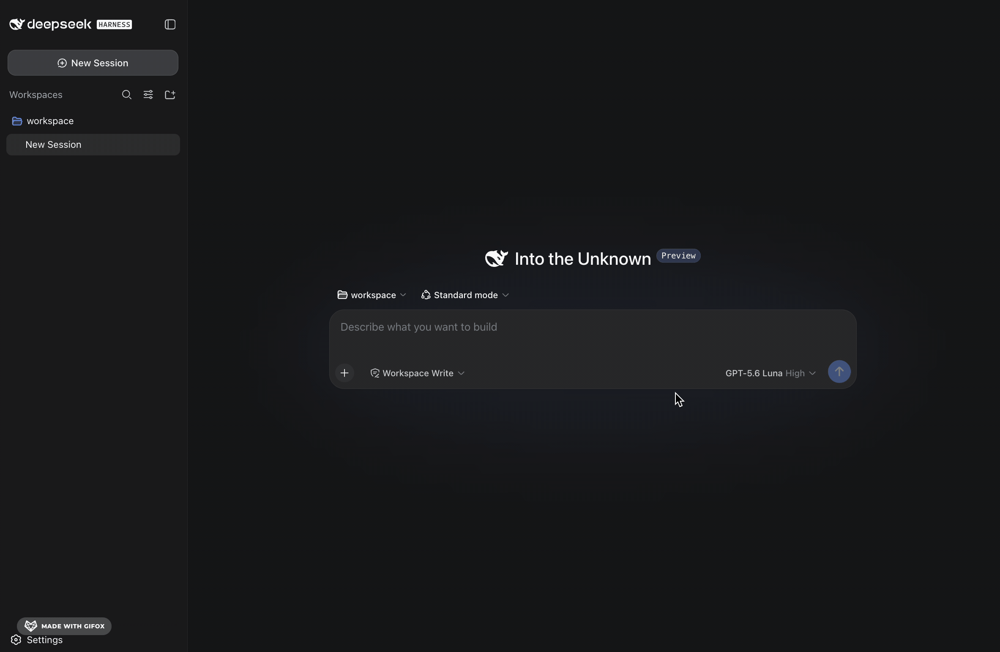

# dsh-llm-nous 🚀

Give [DeepSeek Harness](https://github.com/deepseek-ai/deepseek-harness) a direct line to the [Nous Portal](https://portal.nousresearch.com/) model buffet — without forking Harness or touching its core.

`dsh-llm-nous` is a standalone Harness bundle. It registers a `nous` provider route, speaks Nous's OpenAI-compatible API, and keeps the provider-specific weirdness where it belongs: inside the plugin.

## What you get

- **Provider route:** `nous`
- **Nous API:** `https://inference-api.nousresearch.com/v1`
- **Credential:** `NOUS_API_KEY`
- **Streaming:** OpenAI-compatible SSE, including Nous's clean EOF without `[DONE]`
- **Reasoning:** OpenAI-compatible `delta.reasoning`
- **Models:** picker-friendly defaults plus arbitrary Nous model IDs via configuration
- **Default output cap:** 8,192 generated tokens — raise it when your selected model has room
- **Harness core changes:** none

## Install it

npm is optional. Pick your flavor:

```sh
# GitHub — easiest for sharing
dsh plugin --profile web add github:patrickluvsoj/dsh-llm-nous

# Local checkout
dsh plugin --profile web add /absolute/path/to/dsh-llm-nous

# Tarball
dsh plugin --profile web add ./dsh-llm-nous-0.1.0.tgz

# npm, if published there later
dsh plugin --profile web add dsh-llm-nous
```

For a Harness source checkout, prefix the first two commands with `pnpm` and add `--ignore-workspace-root-check` to the install command:

```sh
pnpm dsh plugin --profile web add --ignore-workspace-root-check github:patrickluvsoj/dsh-llm-nous
```

## Add your Nous key

```sh
export NOUS_API_KEY='your-nous-portal-key'
```

For a source checkout, a gitignored `.env` works too:

```dotenv
NOUS_API_KEY=your-nous-portal-key
```

The key belongs in the environment or Harness's credential store — **not** in Cordis YAML, Git, screenshots, or package files. Tiny security basics; civilization survives another day.

## Start Harness

```sh
dsh --profile web
```

Or from the Harness source checkout:

```sh
pnpm dsh --profile web
```

The bundle defaults new sessions to:

```text
deepseek/deepseek-v4-flash-0731
```

That model is paid and requires available Nous Portal credits. The bundle also advertises this free model from the usage-ranked catalog:

```text
poolside/laguna-s-2.1:free
```

## Choose a model

### Web dashboard: point, click, model

Harness exposes configured providers in **Settings → Models**. After `dsh-llm-nous` is loaded, the Nous provider and its advertised models can appear in the model picker.

*This is the upstream Harness model-settings UI; the Nous card/model entries appear after the Nous bundle is installed.*

Select a model in the picker and it becomes the default for **new sessions**. A session that has already sent a request keeps the provider/model recorded in its own log. Model changes apply on the next request; no server restart is needed for an ordinary selection change.

### Search the full Nous catalog and pin favorites

With the current Harness composer picker, the live Nous catalog is no longer squeezed into one heroic dropdown. The picker keeps the first 12 models from each provider compact, then lets you:

- search every compatible model returned by Nous Portal, across provider name, model name, exact model ID, and description;
- expand a provider to browse its complete catalog without searching;
- pin or unpin an exact Nous model with the star action beside the model;
- keep favorites profile-wide, so pinned models stay at the top across sessions and after restarting Harness;
- keep the current model visible even if Nous later removes it from the advertised catalog.

Search appears automatically when the available catalog is larger than the compact view. Pins are a UI preference stored by Harness; they do not rewrite the plugin's configured `models` fallback.



Live discovery is the default (`catalogMode: live`). The plugin makes an authenticated `GET /models` request to the configured Nous endpoint and merges compatible live routes into the picker. These twelve curated routes stay pinned first, preserving their OpenRouter trailing-week usage rank:

```text
deepseek/deepseek-v4-flash-0731
xiaomi/mimo-v2.5
tencent/hy3
deepseek/deepseek-v4-flash
openai/gpt-5.6-luna
z-ai/glm-5.2
google/gemini-3.7-flash
deepseek/deepseek-v4-pro
minimax/minimax-m3
poolside/laguna-s-2.1:free
anthropic/claude-opus-5
openai/gpt-5.6-sol
```

The ranking measures adoption by prompt-plus-completion token volume, not model quality. OpenRouter-only routes and variants absent from Nous are skipped. Source and attribution: [OpenRouter rankings](https://openrouter.ai/rankings), as of 2026-08-25. OpenRouter is not queried at runtime; runtime discovery calls only the configured Nous `/models` endpoint. The request carries the resolved Nous bearer credential and Harness's standard, non-secret `User-Agent` attribution header.

The merge is deterministic:

- configured/curated `models` remain first, in configuration order, and their name, description, context window, and output cap win over conflicting live metadata;
- the compatible live remainder is sorted by display name, then exact model ID;
- empty and duplicate IDs, `:batch` routes, tilde aliases such as `~latest`, expired routes, non-text-output routes, routes without text input, and entries whose explicit `supported_parameters` array lacks `tools` are omitted;
- multimodal routes are accepted when they can consume and produce text, but this adapter advertises text input only because its serializer does not accept image content.

`listModels()` and exact-model resolution share the same successful live snapshot for one hour. Each refresh is limited to five seconds and 4 MiB of response bytes. Before the first successful refresh—or when credentials are missing—the configured/curated list remains available. After a success, an expired snapshot is returned immediately while one background refresh runs. If a refresh fails, the last-good snapshot remains available and credential/catalog retries pause for one minute by default. API keys and raw catalog responses are never cached or written to disk.

The Nous catalog is much larger. A model ID omitted from discovery can still be passed through unchanged by setting it explicitly; it then uses the plugin-wide context and output defaults.

### Terminal/headless: configure it directly

The plugin does not add a separate terminal picker command. For terminal or headless runs, select the model with a normal Harness patch:

```yaml
- id: agent-default-model
  config:
    provider: nous
    model: stepfun/step-3.7-flash:free
```

Run it:

```sh
dsh --profile headless --patch ./nous-model.cordis.yml \
  'Reply with exactly: NOUS_OK'
```

### Use any exact Nous model ID

Create `nous-model.cordis.yml`:

```yaml
- id: agent-default-model
  config:
    provider: nous
    model: openai/gpt-oss-120b
```

Then launch:

```sh
dsh --profile web --patch ./nous-model.cordis.yml
```

The adapter passes the model ID through to Nous unchanged. The model does not have to be in the advertised catalog.

## Configure model discovery

The defaults are live discovery, a one-hour successful-response cache, a five-second request timeout, and a one-minute failed-refresh cooldown:

```yaml
- id: llm-nous
  config:
    apiKeyEnv: NOUS_API_KEY
    baseURL: https://inference-api.nousresearch.com/v1
    catalogMode: live
    catalogCacheTtlMs: 3600000
    catalogTimeoutMs: 5000
    catalogRetryCooldownMs: 60000
    models:
      - id: deepseek/deepseek-v4-flash-0731
        name: DeepSeek V4 Flash 0731
        contextWindow: 1310720
```

`models` is the ordered curated list and the fallback used when live discovery has not succeeded. It is separate from the favorites a user pins in the picker. Supplying `models` replaces the built-in twelve-entry list. Set `catalogMode: curated` to disable `/models` requests completely and expose only this configured list. `catalogCacheTtlMs`, `catalogTimeoutMs`, and `catalogRetryCooldownMs` must be positive integer milliseconds no greater than the platform timer limit. The cooldown applies after failed initial or background refreshes, preventing repeated credential lookup and `/models` requests until it expires.

A patch replaces the entire targeted config, so keep `apiKeyEnv` and `baseURL` when overriding discovery settings.

## Tune the output budget

`maxTokens` limits generated tokens for one response. That includes visible text, reasoning, and model-generated tool calls. It is not the conversation-memory limit; that is the model's context window.

Raise it for a model with enough context:

```yaml
- id: llm-nous
  config:
    apiKeyEnv: NOUS_API_KEY
    baseURL: https://inference-api.nousresearch.com/v1
    maxTokens: 32768
```

A patch replaces the entire targeted config, so keep `apiKeyEnv` and `baseURL` when overriding `llm-nous`.

Per-model caps are supported too:

```yaml
- id: llm-nous
  config:
    apiKeyEnv: NOUS_API_KEY
    baseURL: https://inference-api.nousresearch.com/v1
    maxTokens: 32768
    models:
      - id: stepfun/step-3.7-flash:free
        contextWindow: 256000
        maxTokens: 8192
      - id: deepseek/deepseek-v4-pro-0813
        contextWindow: 1048576
        maxTokens: 32768
```

Effective precedence:

```text
explicit request maxTokens
→ model-specific maxTokens
→ plugin-wide maxTokens
→ 8,192 default
```

## Verify the setup

Inspect the composed profile:

```sh
dsh --profile web --dump-config
```

Look for the `dsh-llm-nous` layer and `provider: nous`.

Run a tiny smoke test:

```sh
dsh --profile headless \
  --patch ./nous-model.cordis.yml \
  'Reply with exactly: NOUS_OK'
```

## Troubleshooting

### HTTP 404 mentioning credits

The request reached Nous, but the selected model is paid and the Portal account has no available credits. Choose a free model or add credits.

### HTTP 400 mentioning context length

The requested output cap plus the prompt, conversation, and tool definitions exceeds the model's total context window. Lower `maxTokens` or choose a model with more context.

### `MISSING_CREDENTIAL`

Harness cannot find `NOUS_API_KEY`. Export it in the launching environment or store it through the Harness credential UI.

### `DUPLICATE_ADAPTER`

Two plugins are registering the `nous` route. Keep only one `dsh-llm-nous` bundle active in the profile.

## Development

```sh
pnpm install
pnpm run build
pnpm test
```

The runtime artifact is `lib/index.mjs`. It bundles its runtime dependencies, so an installed bundle does not need a sibling Harness checkout.

## License

MIT
